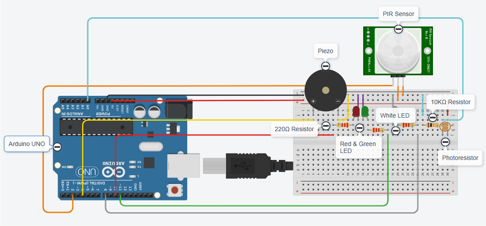
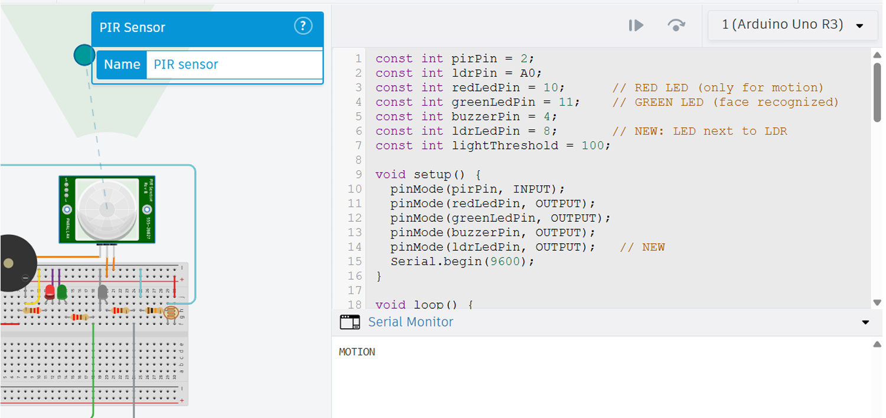
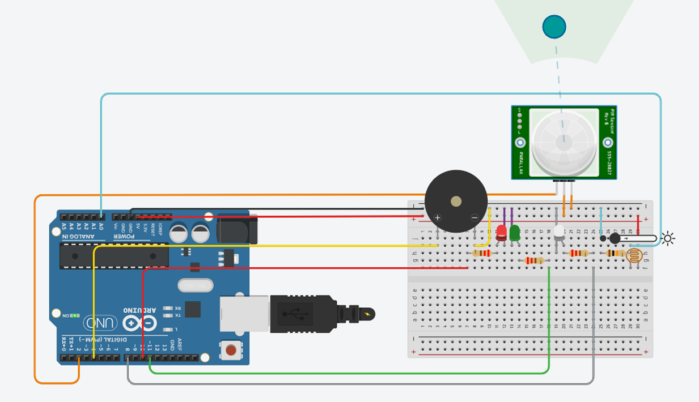
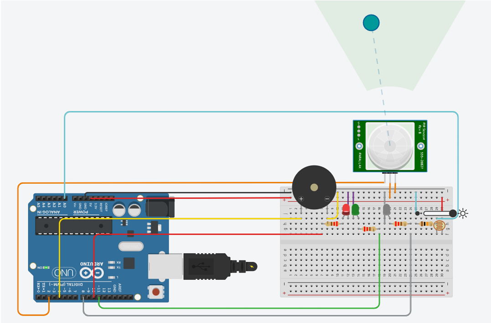
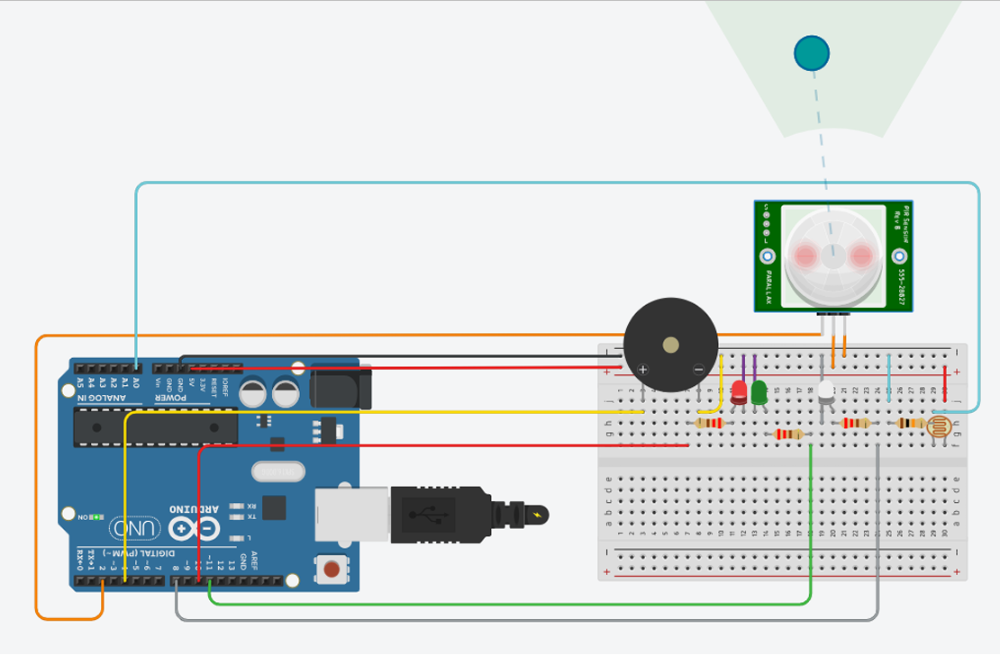

# Home Security System using Arduino & OpenCV

An intelligent home security system that integrates Arduino sensors with real-time face recognition using OpenCV. The system detects motion, identifies individuals, and automatically controls access while triggering alerts for intruders.

---

## Features

- 🔍 Motion detection using PIR sensor
- 🎥 Real-time face recognition using OpenCV (LBPH)
- 💡 Automatic lighting using LDR sensor for low-light conditions
- 🔐 Smart access control (unlock for known faces)
- 🚨 Intruder alert system using Piezoelectric buzzer
- 🔴🟢 LED indicators for system status
- 🔗 Serial communication between Python and Arduino

---

## System Workflow

1. PIR sensor detects motion near the door
2. Arduino sends "MOTION" signal to Python
3. Webcam activates and captures face
4. Face recognition is performed:
   - ✅ Recognized → Door unlocks (Green LED ON)
   - ❌ Unknown → Alarm triggers (Red LED + Buzzer)
5. LDR sensor ensures proper lighting for face detection

---

## Hardware Components

- Arduino UNO
- PIR Motion Sensor
- LDR (Photoresistor)
- White LED (for illumination)
- Red LED (Intruder indicator)
- Green LED (Access granted)
- Piezoelectric Buzzer
- Webcam

---

## Software Requirements

- Python 3.x
- OpenCV (cv2)
- NumPy
- PySerial
- Arduino IDE

---

## 📁 Project Structure

```
Home-Security-System/
│
├── dataset/                # Face dataset (ignored in git)
├── collect_data.py         # Capture face images
├── train_model.py          # Train LBPH model
├── recognize_faces.py      # Test face recognition
├── serial_comm.py          # Arduino + Python integration
├── arduino/
│   └── home_security.ino   # Arduino code
├── README.md
```

---

## ▶️ How to Run

### Step 1: Collect Face Data
```
python collect_data.py
```

### Step 2: Train Model
```
python train_model.py
```

### Step 3: Test Face Recognition
```
python recognize_faces.py
```

### Step 4: Run Full System
- Upload Arduino code
- Run:
```
python serial_comm.py
```

---

## Circuit Diagram



---

## 📸 Output Screenshots

### 🔹 Motion Detection (Serial Monitor)


### 🔹 LDR Sensor - Sufficient Light (LED OFF)


### 🔹 LDR Sensor - Low Light (LED ON)


### 🔹 Intruder Alert System
- Red LED ON  
- Piezoelectric buzzer activated  



---

## Key Concepts Used

- Computer Vision (Face Detection & Recognition)
- IoT (Sensor-based automation)
- Serial Communication (Python ↔ Arduino)
- Embedded Systems Integration

---

## Notes

- Ensure correct COM port is set in `serial_comm.py`
- Dataset and trained files are not included in the repository
- Lighting conditions affect recognition accuracy

---

## Future Improvements

- Add deep learning-based face recognition (CNN)
- Mobile app integration
- Cloud-based logging system
- Multi-user access control with database

---

## Authors
1. Nishita Singh : [ohnonyx](https://github.com/ohnonyx)
2. Nithya Anantharaman : [nithya049](http://github.com/nithya049)
3. Nithya Prashaanthi R. : [nithya-1385](https://github.com/nithya-1385)

---
